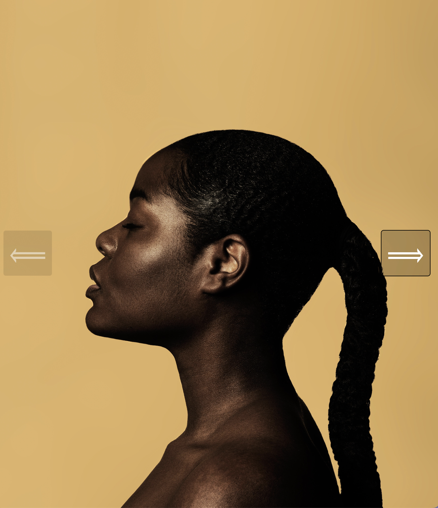

  

<h1 align="center">Animated Image Carousel</h1>

## Description

This app is a image carousel that has an animated transition to the next or previous photo.

## Built With

- ReactJS
- CSS
- HTML

## Website

## Contribution

Made with ❤️ by Nicole Barranca

## Questions

Feel free to contact me directly at nikkibarranca@gmail.com if you have any questions about the repo.

You can find more of my work at [Nicole Barranca](https://github.com/NicoleBarranca).
